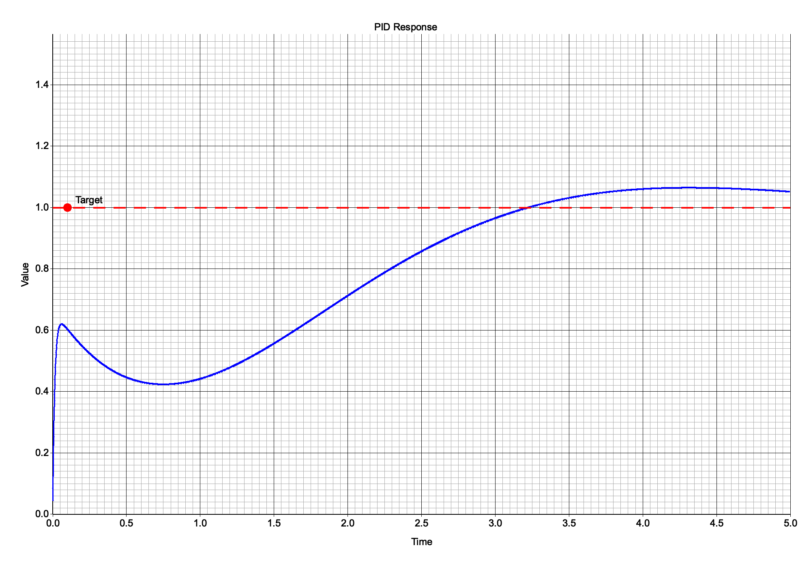

# PID-Visualizer

UI lets you set target value and acceptable response time, and PID coefficients for selected drone model.

The result is PID Response graph:

Made with Rust + Actix + Plotters + Angular